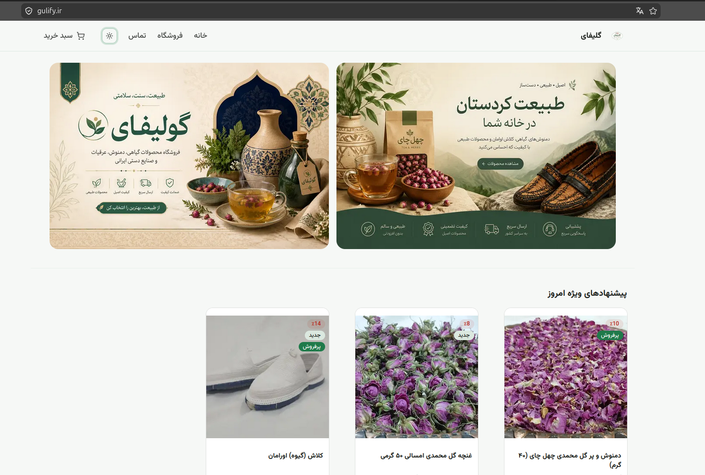
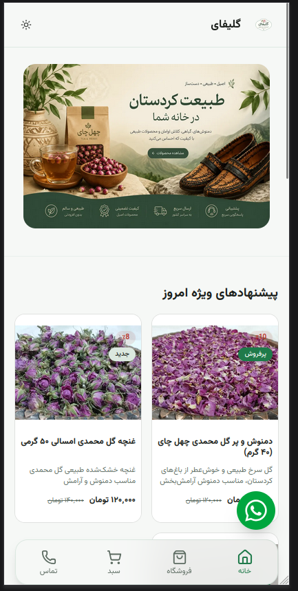

# 🌿 Gulify — Western Iran Souvenir Store

A modern, high-performance e-commerce platform showcasing authentic souvenirs and natural products from **Kurdistan, Kermanshah, and Hawraman region (Western Iran)**.

| Desktop Main Page | Mobile Main Page |
|--------------|--------------|
|  |  |

---

## ✨ Overview

Gulify is a culturally inspired online store focused on selling **traditional and natural products of Western Iran**, including:

- 🌹 Damask Rose (Gol Mohammadi)
- 🌿 Herbal teas and natural infusions
- 👡 Handmade Kalash (Hawraman traditional footwear)
- 🎁 Regional souvenirs from Kurdistan & Hawraman

The goal is to combine **local culture + modern web technology** into a scalable e-commerce experience.

---

## 🚀 Features

- 🛍️ Product-based architecture (scalable catalog system)
- ⚡ Next.js 16 App Router architecture
- 🎨 Modern UI with Tailwind CSS 4
- 🧠 Global state management with Zustand
- 📦 Variant-based product system (size, SKU, stock)
- 🔔 Notifications via Sonner
- 🎞️ Smooth animations with Framer Motion
- 📱 Fully responsive (mobile-first design)
- 🔍 SEO-optimized structure (metadata + keywords + schema-ready)

---

## 🛠️ Tech Stack

- Next.js 16
- React 19
- TypeScript
- Tailwind CSS 4
- Framer Motion
- Zustand
- Zod
- Lucide React
- Embla Carousel
- Sonner
- clsx + tailwind-merge

---

## 🧱 Product System

Each product supports:

- SEO fields (`seoTitle`, `seoDescription`)
- Variant system (size/stock/SKU)
- Inventory tracking
- Category & subcategory structure
- Image gallery support
- Pricing & discount logic
- Feature flags (bestseller, featured, new)

---

## 📦 Installation

```bash
git clone https://github.com/Mobin-Karam/flower-shop.git
cd flower-shop
npm install
npm run dev
```
