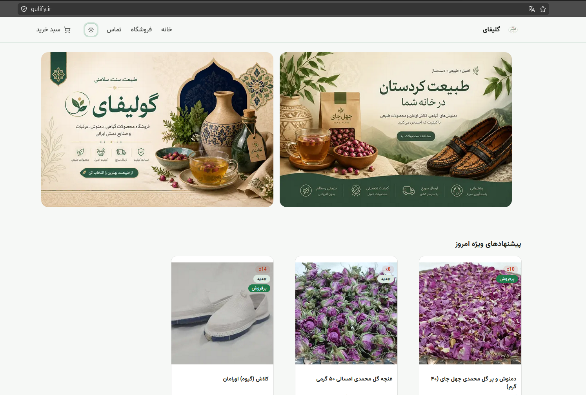
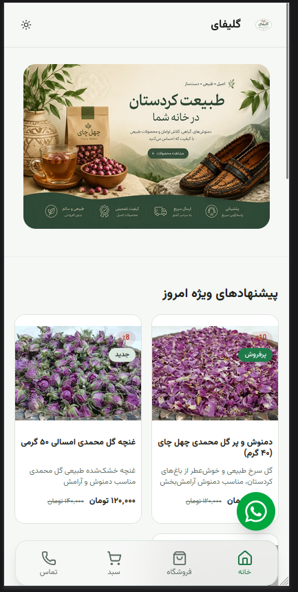

# Gulify — سوغات کردستان و غرب ایران

A modern e-commerce platform for authentic souvenirs and natural products from **Kurdistan, Hawraman, and Western Iran**.

---

## Screenshots

| Desktop | Mobile |
|:-------:|:------:|
|  |  |

---

## Overview

Gulify is a culturally inspired online store selling traditional and natural products of Western Iran:

- Rose petals & herbal teas
- Handmade Kalash (Hawraman traditional footwear)
- Kurdish handicrafts & woven rugs
- Mountain honey & natural products

---

## Tech Stack

| Layer | Technology |
|-------|-----------|
| Framework | Next.js 16 (App Router) |
| Language | TypeScript |
| UI | shadcn/ui + Radix UI |
| Styling | Tailwind CSS 4 |
| State | Zustand (persist) |
| Animations | Framer Motion |
| Carousel | Embla Carousel |
| Validation | Zod |
| Icons | Lucide React + React Icons |
| Notifications | Sonner |

---

## Project Structure

```
frontend/
├── app/
│   ├── (storefront)/          # Public storefront routes
│   │   ├── page.tsx           # Homepage
│   │   ├── shop/
│   │   │   ├── page.tsx       # Shop page (search, filter, sort, grid)
│   │   │   └── [slug]/        # Product detail page
│   │   └── components/
│   │       ├── shop/          # Shop page components (11 files)
│   │       └── hero-carousel.tsx
│   ├── (account)/             # User account pages
│   ├── (admin)/               # Admin dashboard
│   ├── (checkout)/            # Checkout flow
│   ├── (blog)/                # Blog pages
│   ├── components/
│   │   ├── ui/                # shadcn/ui components (18)
│   │   ├── cart/              # Cart components
│   │   └── navbar.tsx
│   ├── store/                 # Zustand stores
│   │   ├── cart-store.ts
│   │   ├── ui-store.ts
│   │   └── loading-store.ts
│   └── api/                   # API routes
├── lib/
│   ├── products.ts            # Product data
│   ├── types.ts               # TypeScript types
│   ├── analytics.ts           # Event tracking
│   ├── use-recently-viewed.ts # Recently viewed hook
│   └── pricing.ts             # Price calculation
└── public/
    ├── banners/               # Banner images
    ├── flowers/               # Product images
    ├── kalaash/               # Product images
    └── logo/                  # Logo
```

---

## Features

### Shop Page
- **Instant search** with debounce, recent searches, popular suggestions
- **Dynamic filters** — price range, brand, rating, stock, tags, discount
- **Collection tabs** — All, New, Featured, Popular, Best Seller, Sale, Trending
- **Sorting** — newest, popular, rating, price (low/high), discount
- **Product grid** — 2/3/4 columns + list view (user preference saved)
- **Pagination** — numbered with 12/24/48 per-page selector
- **Recently viewed** — localStorage-based tracking
- **Recommended** — category/tag-based scoring algorithm

### Product Page
- Image gallery with lightbox
- Variant selection (size, weight)
- Mobile add-to-cart bar (sticky bottom)
- Desktop add-to-cart sidebar
- Product story section (origin, production, meaning)
- Recently viewed tracking

### Cart
- Persistent cart (Zustand + localStorage)
- Desktop hover popover with recommendations
- Mobile bottom drawer
- Product quantity controls

### Homepage
- Auto-playing hero carousel (Embla + autoplay)
- Deals section with discount products
- CTA section

### UI/UX
- RTL Persian layout (Vazirmatn font)
- Dark/light mode (next-themes)
- Responsive mobile-first design
- Skeleton loading states
- Sticky search bar on shop page
- Bottom-sheet mobile filters (shadcn Sheet)

### SEO
- Dynamic metadata per page
- OpenGraph + Twitter Cards
- JSON-LD structured data
- Canonical URLs
- Sitemap + Robots.txt

### Performance
- Image optimization (AVIF/WebP)
- Aggressive caching headers
- Compression enabled
- Lazy loading below fold
- Debounced search input

---

## Version History

### v1.1.0 (Current)

**Major: Shop page rebuild**

- Rewrote shop page with full e-commerce features
- Added instant search with debounce, recent/popular suggestions
- Added dynamic filters (price, brand, rating, stock, tags, discount)
- Added collection tabs (New, Featured, Popular, Best Seller, Sale, Trending)
- Added sort options (7 sorts) + grid/list view toggle
- Added pagination with per-page selector (12/24/48)
- Added recently viewed products (localStorage)
- Added recommended products (category/tag scoring)
- Added mobile bottom-sheet filter drawer
- Added sticky search bar on scroll
- Enhanced product card with hover image, wishlist, share, rating
- Fixed mobile product page add-to-cart visibility bug
- Fixed hero carousel to use shadcn Carousel with autoplay
- Added analytics event tracking system
- Added 6 new shadcn UI components (sheet, tabs, checkbox, select, skeleton)
- Optimized Next.js config for production (images, caching, compression)

### v1.0.0

**Initial release**

- Homepage with hero banners and deals section
- Product detail page with gallery, variants, and mobile CTA
- Cart with localStorage persistence
- Dark/light mode toggle
- RTL Persian layout with Vazirmatn font
- Responsive mobile bottom navigation
- SEO metadata and structured data
- Admin API routes (Telegram + Bale notifications)

---

## Installation

```bash
git clone https://github.com/Mobin-Karam/flower-shop.git
cd flower-shop/frontend
npm install
npm run dev
```

## Production Build

```bash
npm run build
npm start
```

## Environment Variables

Create a `.env` file in the `frontend/` directory:

```env
NEXT_PUBLIC_SITE_URL=https://gulify.ir
BALE_BOT_TOKEN=your_bale_token
BALE_CONTACT_CHANNEL=@your_channel
TELEGRAM_BOT_TOKEN=your_telegram_token
TELEGRAM_CONTACT_CHANNEL=@your_channel
```

---

## Deployment

### Vercel (Recommended)

Push the `frontend/` directory to GitHub and connect to Vercel. It auto-detects Next.js.

### VPS (Any Linux server)

```bash
# Build
cd frontend
npm install
npm run build

# Run with PM2
pm2 start npm --name "gulify" -- start
pm2 save

# Nginx reverse proxy
server {
    listen 80;
    server_name gulify.ir;

    location / {
        proxy_pass http://localhost:3000;
        proxy_http_version 1.1;
        proxy_set_header Upgrade $http_upgrade;
        proxy_set_header Connection 'upgrade';
        proxy_set_header Host $host;
        proxy_cache_bypass $http_upgrade;
    }
}
```

---

## License

Private — All rights reserved.
